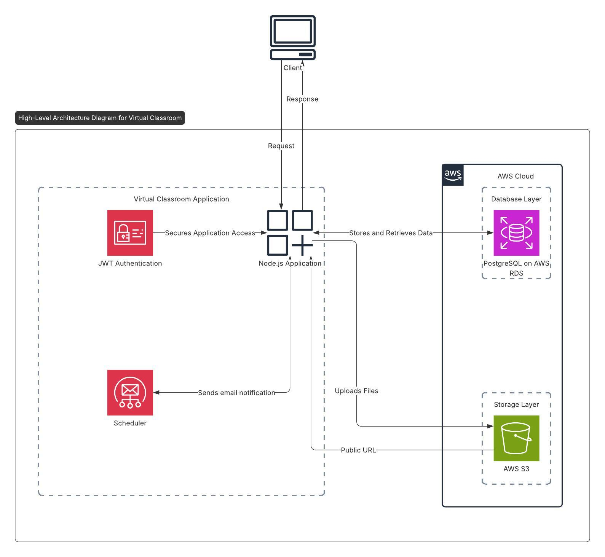
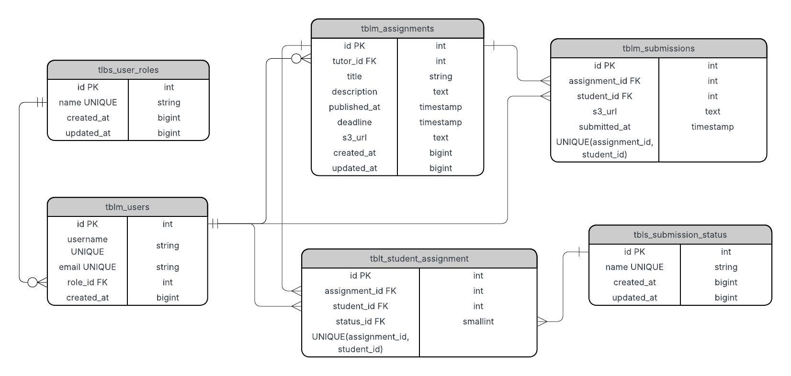

# Virtual Classroom

The Virtual Classroom is a Node.js-based application designed to facilitate online learning. It provides features for managing assignments, submissions, and user roles (tutors and students). The application uses PostgreSQL (deployed on AWS RDS) as the database and AWS S3 for file storage.

## Features

- **User Roles**: Supports `Tutor` and `Student` roles.
- **Assignments**: Tutors can create, update, and delete assignments. Students can view and submit assignments.
- **Submissions**: Students can upload assignment submissions, and tutors can view all submissions.
- **Authentication**: JWT-based authentication for secure access.
- **File Uploads**: Uses AWS S3 for storing assignment files and submissions.
- **Notifications**: Sends email reminders to students for upcoming assignment deadlines.

## Deployed Server

The Virtual Classroom application is deployed and accessible at the following link:

**[Deployed Server URL](http://virtual-classroom-env.eba-48psufpg.ap-south-1.elasticbeanstalk.com/)**

**[API Docs](http://virtual-classroom-env.eba-48psufpg.ap-south-1.elasticbeanstalk.com/api-docs)** -> Change the server from local to the deployed URL to hit the APIs

---

## High-Level Architecture

Below is the high-level architecture diagram for the Virtual Classroom application:



---

## ER Diagram

Below is the Entity Relationship (ER) diagram for the database schema used in the Virtual Classroom application:



---

## Prerequisites

- Docker and Docker Compose (for containerized deployment)
- Node.js (v16 or higher) (if running locally)
- PostgreSQL
- AWS account with S3 bucket
- `.env` file with the required environment variables

## Installation

### Running Locally

1. Clone the repository:
   ```bash
   git clone <repository-url>
   cd Virtual Classroom
   ```

2. Install dependencies:
   ```bash
   npm install
   ```

3. Set up the `.env` file:
   Create a `.env` file in the root directory with the following variables:
   ```
   PORT=8000
   DB_USER=<your-db-user>
   DB_PASSWORD=<your-db-password>
   DB_HOST=<your-db-host>
   DB_PORT=5432
   DB_DATABASE=<your-db-name>
   APP_SECRET=<your-app-secret>
   AWS_ACCESS_KEY_ID=<your-aws-access-key-id>
   AWS_SECRET_ACCESS_KEY=<your-aws-secret-access-key>
   AWS_REGION=<your-aws-region>
   AWS_S3_BUCKET_NAME=<your-s3-bucket-name>
   EMAIL_USER=<your-email@example.com>
   EMAIL_PASSWORD=<your-email-password>
   ```

4. Set up the database:
   - Create the database schema and tables by running the SQL script:
     ```bash
     psql -U <your-db-user> -d <your-db-name> -f database/setup.sql
     ```

5. Start the application:
   ```bash
   node index.js
   ```

6. Access the application:
   Open your browser and navigate to `http://localhost:8000`.

---

### Running with Docker

1. Clone the repository:
   ```bash
   git clone <repository-url>
   cd Virtual Classroom
   ```

2. Set up the `.env` file:
   Create a `.env` file in the root directory with the required environment variables (see above).

3. Build the Docker image:
   ```bash
   docker build -t virtual-classroom .
   ```

4. Run the Docker container:
   ```bash
   docker run -p 8000:8000 --env-file .env virtual-classroom
   ```

5. Access the application:
   Open your browser and navigate to `http://localhost:8000`.

---

## Project Structure

- **config/**: Configuration files for database, AWS S3, and Swagger.
- **constants/**: Constants for roles and submission statuses.
- **controllers/**: Handles HTTP requests and responses.
- **dao/**: Data Access Objects for interacting with the database.
- **middlewares/**: Middleware for authentication and file uploads.
- **models/**: Request models for validating and structuring data.
- **routes/**: API routes for the application.
- **services/**: Business logic for assignments, submissions, notifications, and user management.
- **schedulers/**: Cron job schedulers for background tasks.
- **utils/**: Utility functions for database transactions, object mapping, and Swagger configuration.
- **sql/**: SQL scripts for setting up the database.

## API Endpoints

### Public Routes

- **POST /api/login**: User login.

### Protected Routes

#### Assignments
- **POST /api/assignments**: Create a new assignment (Tutor only).
- **GET /api/assignments**: Get assignments (based on user role and filters).
- **PATCH /api/assignments/:id**: Update an assignment (Tutor only).
- **DELETE /api/assignments/:id**: Delete an assignment (Tutor only).

#### Submissions
- **POST /api/assignments/submissions**: Add a submission (Student only).
- **GET /api/assignments/submissions/:assignmentId**: Get submissions for an assignment.

## Notifications for Upcoming Assignments

### Overview
The system sends email reminders to students for assignments that are due within the next hour. This ensures students are notified in time to complete their submissions.

### Architecture
1. **Database Query**:
   - Fetch assignments with deadlines 1 hour from now from the `tblm_assignments` table.
   - Join with `tblt_student_assignments` to get the assigned students and their statuses.
   - Join with `tblm_users` to get the students' email addresses.

2. **Notification Service**:
   - A service fetches the upcoming assignments and sends email notifications to the respective students.

3. **Scheduler**:
   - A cron job runs every minute to check for upcoming deadlines and trigger the notification service.

### Technologies Used
- **Database**: PostgreSQL (existing setup).
- **Email Service**: Nodemailer (SMTP).
- **Scheduler**: node-cron.
- **Backend**: Node.js.

### Working Details
1. **Database Query**:
   - Fetch assignments with deadlines within the next hour and filter out submissions already marked as "SUBMITTED".

2. **Notification Job**:
   - Use `node-cron` to schedule a job that runs every minute.
   - Execute the query and process the results.

3. **Email Sending**:
   - Use Nodemailer to send email notifications to students.
   - Include assignment title and deadline in the email content.

4. **Error Handling**:
   - Log errors for failed email deliveries.
   - Retry sending emails for transient failures.

## Environment Variables

| Variable                | Description                                      |
|-------------------------|--------------------------------------------------|
| `PORT`                 | Port number for the application.                 |
| `DB_USER`              | Database username.                               |
| `DB_PASSWORD`          | Database password.                               |
| `DB_HOST`              | Database host.                                   |
| `DB_PORT`              | Database port (default: 5432).                   |
| `DB_DATABASE`          | Database name.                                   |
| `APP_SECRET`           | Secret key for JWT token signing.                |
| `AWS_ACCESS_KEY_ID`    | AWS access key ID for S3.                        |
| `AWS_SECRET_ACCESS_KEY`| AWS secret access key for S3.                    |
| `AWS_REGION`           | AWS region for S3.                               |
| `AWS_S3_BUCKET_NAME`   | AWS S3 bucket name for file storage.             |
| `EMAIL_USER`           | Email address for sending notifications.         |
| `EMAIL_PASSWORD`       | Password or app-specific password for the email. |

## Technologies Used

- **Backend**: Node.js, Express.js
- **Database**: PostgreSQL
- **Authentication**: JWT
- **File Storage**: AWS S3
- **Email Notifications**: Nodemailer
- **Scheduler**: node-cron
- **Containerization**: Docker
- **Other Libraries**: `multer`, `dotenv`, `@aws-sdk/client-s3`

## Development

### Running in Development Mode

Use `nodemon` for automatic server restarts during development:
```bash
nodemon index.js
```

---